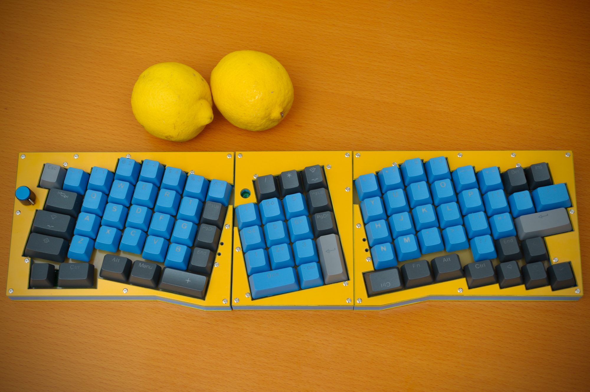
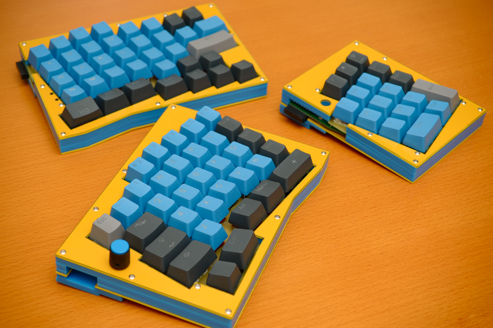

# について / About
Colice（コリス）

アリスのレイアウトに発想を得た、部位を組み合わせられるカラムスタッガー（列ずれ）配列の自作キーボード。
Self-made "Col"umnar stagger combinational moduler keyboard, inspired by Al"ice" layout.

## 特徴 / Features
- 一体型かつ分離型でレイアウトが変えられる
- トップマウント形式のケース
- ロータリーエンコーダを2個使用可能
- 総当たりマトリクス（2乗マトリクス）を採用
Pro Micro 1個で全てを制御
- I2C用のピンは未使用
- LEDチョットダケ光る
- 本来のケース外形はもっと丸い感じでかわいい
発注時ミスで、v.0.2は四角い外形になっている

## キー配列 / Layout

## 写真
